### Theme Installation

The first step is to unzip the downloaded package. You will find the actual theme inside and a documentation file. Do the following steps to upload the theme to your blog.

* Los in to your Ghost website admin (example.com/ghost)
* In the left-side menu of your admin click **Design**
* Scroll down to the **INSTALLED THEMES** section
* Click **Upload a theme**
* Select the theme file ({{page.short_name}}.zip)
* Once uploaded, click on Activate now to activate the theme immediately or Close if you want to activate it later

### Create a New Content API Key
In order for the theme search to work, make a new _Content API Key_ by following the next steps.

In the left-side menu of your Ghost admin click **Integrations** then **+ add custom integration**.

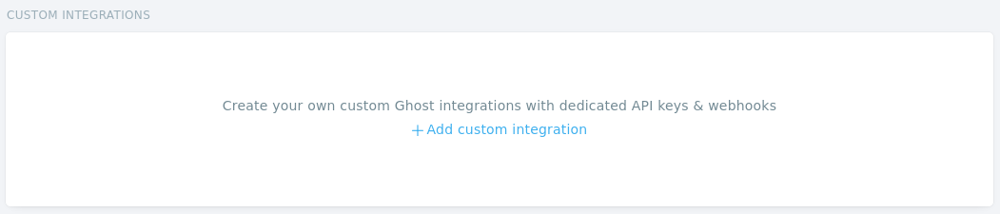

Then, give the new integration a name, for example, _Search_ and click **Create**.

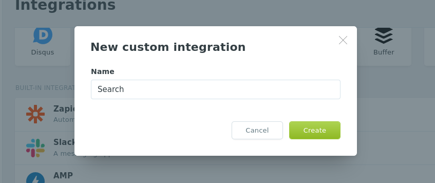

Now, a new **API Key** is created, hover over it and the Copy button will appear, click on it to copy the Key to the clipboard.
Repeat the same with your new **API URL**.

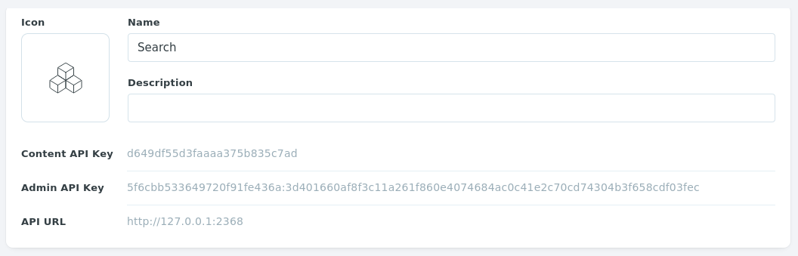

Next, click **Code injection** from the left-side admin menu.

Add the following code to the **Site Header** box after replacing the _`API_KEY`_ value with your API Key and the _`API_URL`_ value with your API Url.

```html
<script>
  var ghostsearch_key = 'API_KEY';
  var ghostsearch_url = 'API_URL';
</script>
```

To be like.

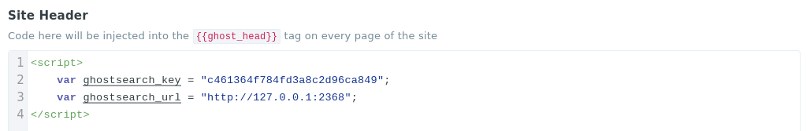

Click **Save**.

### Upload the routes.yaml File
The `routes.yaml` file is required for members sign up and subscription flows.

To upload the file.

* Go to the Ghost admin **Labs** settings page (`/#/settings/labs`)
* Scroll down to the **Routes** section and click the **Upload routes YAML** button
* Select and upload the `routes.yaml` file inside the theme zip file

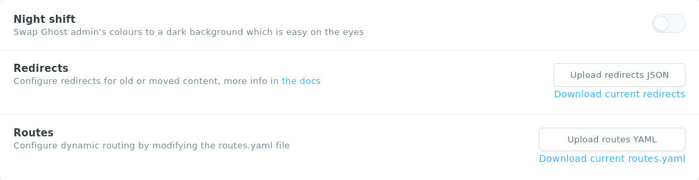

<div class="c-note c-note--info">
	<h6 class="c-note__title">Note</h6>
	<ul class="c-note__body">
		<li>You need to upload the routes.yaml separately. Uploading the theme zip file is not enough.</li>
		<li>There is already a routes.yaml file uploaded to Ghost. This is the default one that comes with Ghost. We need to upload the theme one to override it.</li>
	</ul>
</div>

### Header Navigation
You can add, edit, delete, and reorder menu links on your Ghost blog from the Navigation section in the admin area located at `ghost/#/settings/design`.

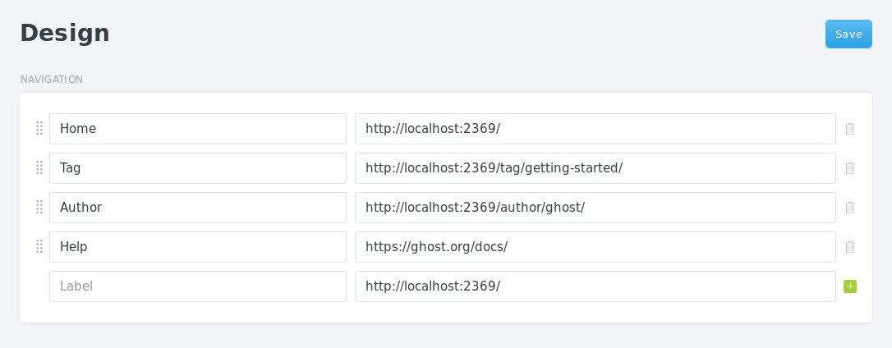

To include a static page on your navigation menu. First, type the name of the page as you’d like it to appear on your menu in the label field.

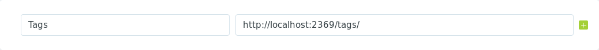

Next, click on the **URL** field of the menu item and we can find that the blog URL is already auto-populate for us. We will need to add the page slug after the final **/**. Once satisfied with our page configurations. Clicking the blue **Save** button will add the page to the navigation menu.

### Tags Page

To create the Tags page:

* From the Ghost admin `Pages` section, create a new page and call it **Tags** for example
* From `Page settings`, choose the `Tags` template from the `Template` dropdown
* Publish the page
* To add the page to the navigation, please check the [Navigation](#header-navigation) section above

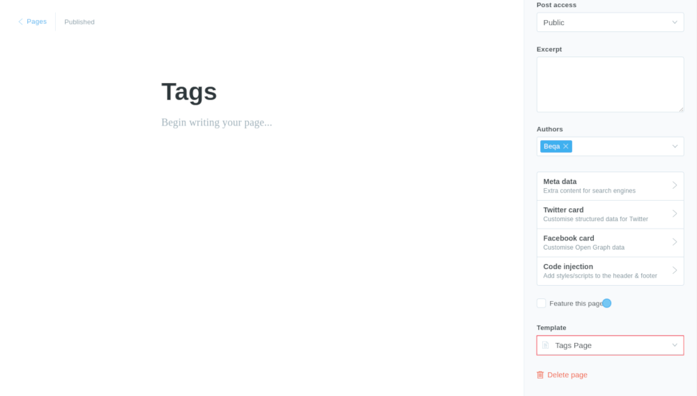

### Authors Page

To create the Authors page:

* Create a new page and call it **Authors** for example
* From `Page settings`, choose the `Authors` template from the `Template` dropdown
* Publish the page
* To add the page to the navigation, please check the [Navigation](#header-navigation) section above

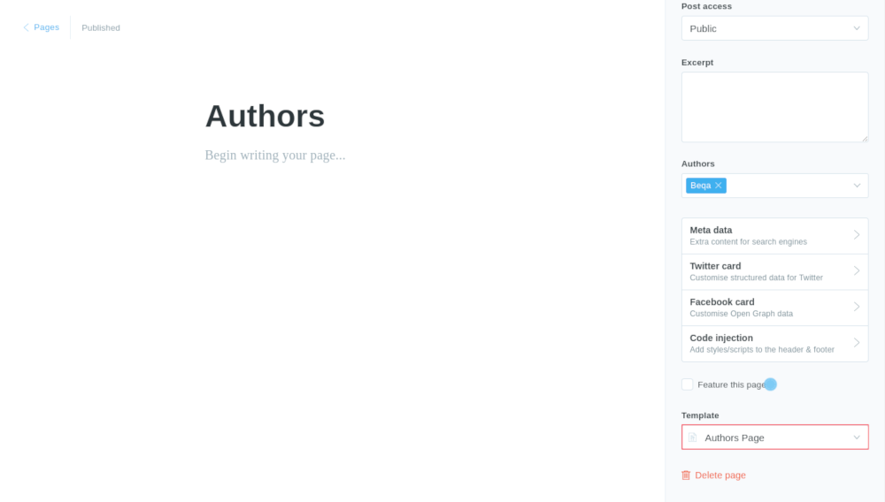

### Disqus Comments

First, make sure you have [registered your website with Disqus (Step 1)](https://help.disqus.com/customer/portal/articles/466182-publisher-quick-start-guide)

Click **Code injection** from the left-side admin menu.

Add the following code to the **Site Header** box after replacing the _`DISQUS_SHORTNAME`_ value with your **Disqus shortname**.

```html
<script>
	var disqus_shortname = "DISQUS_SHORTNAME";
</script>
```
To be like.

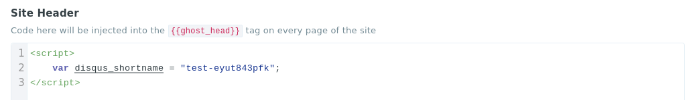

Click **Save**.

Check the [Disqus troubleshooting guide](https://help.disqus.com/customer/portal/articles/472007-i-m-receiving-the-message-%22we-were-unable-to-load-disqus-%22) if you still have issues.

#### Show Comments for Signed-in Users Only

If you want to show the comments for signed-in users only, open the `post.hbs` file and replace line `33` (`{{> contexts/post/comments-section}}`) replace with the following code.


```handlebars
{{#if @labs.members}}
	{{#if @member}}
		{{> contexts/post/comments-section}}
	{{/if}}
{{/if}}
```


You can read more about Ghost visibility choices at [Content visibility](https://ghost.org/docs/members/content-visibility/).

### Posts Per Page
You can control how many posts to show per page from the `package.json` file like this:

```js
"config": { "posts_per_page": 6 }
```

The theme default value is set to `6` posts per page.

### Syntax Highlighting

You can add a fenced code block by placing triple backticks ``` before and after the code block. For example:

~~~
```
pre {
	background-color: #f4f4f4;
	max-width: 100%;
	overflow: auto;
}
```
~~~

Will produce the following gray look.

To **highlight** a code block. Add the language alias like `css` or `js` to the code block. For example, the CSS code in the previous example will wrap follows:

~~~
```css
	...your css code here
```
~~~

Will produce the following colored look.

```css
pre {
	background-color: #f4f4f4;
	max-width: 100%;
	overflow: auto;
}
```

To add an **inline code**, you can wrap the text between two backticks, for example:

~~~
`This inline code example`
~~~

Will produce the following look:

`This inline code example`

{{page.title}} shipped with [Prism.js](http://prismjs.com/), a lightweight, robust, and elegant syntax highlighter.

The [initial Prism package](http://prismjs.com/download.html#themes=prism&languages=markup+css+clike+javascript) includes some languages like _Markup_, _CSS_, _C-like_, and _JavaScript_.

You can add and support more languages. For example, to add support for PHP:

Get the PHP component script from [Prism CDN](https://cdnjs.com/libraries/prism).

```html
<script src="https://cdnjs.cloudflare.com/ajax/libs/prism/1.13.0/components/prism-php.js"></script>
```

Add the script to Ghost **Code Injection** _Site Footer_ section. Click the **Save** button.

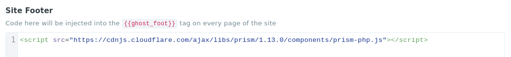

### Google Analytics
To integrate Google Analytics, I would recommend using [Google Analytics](https://ghost.org/integrations/google/) integration by Ghost.

### Social Sharing Icons
You can customize and update the post social media sharing icons from the `partials/social-icons.hbs` theme file.

### Update Favicon
You can change the favicon in Ghost from the _Admin \> General \> PUBLICATION IDENTITY \> Publication icon_ from the Publication icon section.
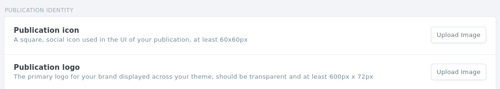

### Theme Translation

{{page.title}} supports Ghost i18n and comes with **English** and **Spanish** translation.

To use another available language than English, go to **Admin \> General \> PUBLICATION INFO \> Publication Language** and enter the [_ISO Code_](https://www.w3schools.com/tags/ref_language_codes.asp).

* `en` for English
* `es` for Spanish

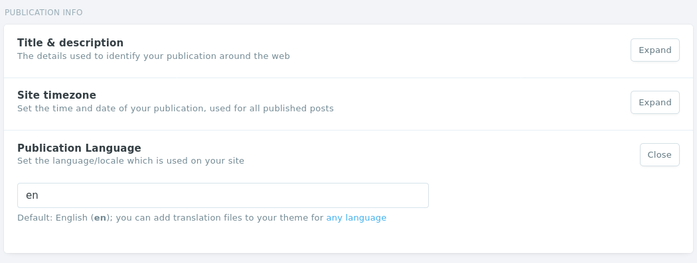

#### Add New Language
To add a new language, follow the following steps:

* Create a new file under the theme `locales` folder with the language [ISO Code](https://www.w3schools.com/tags/ref_language_codes.asp) code. So, if the new language will be Arabic, the new file name will be `ar.json`
* Copy the `en.json` file content into your new file and start to translate as shown in the following section
* Go to **Admin \> General \> PUBLICATION INFO \> Publication Language** and enter the language code which will be `ar` in this example

#### Edit Translation

To improve or edit a translation in a specific available language. You can open the language file under `locales` folder:

```
|____locales
| |____en.json
| |____es.json
```

For example, the Spanish translation file will look like:

```js
{
	"menu": "menú",
	"close": "cerrar",
	"search...": "buscar...",
	"No results found...": "No se han encontrado resultados...",
	"public": "público",
	"members": "miembros",
	"paid": "pagado",
	"featured": "destacado",
	" and ": " y ",
	"Multiple authors": "Múltiples autores",
	"featured posts": "Publicaciones destacadas",
	"authors": "autores",
	"of": "de",
}
```

Each line consists of a left key (`"Hey there!"`) and the right value (`"¡Hola!"`).

The key is plain English which exists in all translation files and **should not be** changed. You can only change the value.

If you have suggestions to improve the current translations or adding a new language. Please [let me know](mailto:hello@beqathemes.com).


### Theme Development
If you are a developer and need to do heavy customization work. The theme is using [Gulp](https://github.com/gulpjs/gulp) to compile [Sass](http://sass-lang.com/) and JavaScript. This improves the development flow and makes it much faster.

First, make sure you have [**Node.js**](https://nodejs.org/en/), [**npm**](https://www.npmjs.com/), [**Gulp CLI**](https://gulpjs.com/docs/en/getting-started/quick-start#install-the-gulp-command-line-utility), and [**Yarn**](https://yarnpkg.com/) installed.

Run the following command in the theme root directory to install _npm_ and _bower_ dependencies.

```
yarn install
```

To start Gulp, run:
```
yarn dev
```

This will compile Sass and JavaScript files, and start watching changes as you edit files.

Gulp will produce this files:

* `assets/built/libs.js`: The global libs file
* `assets/built/main.js`: The main JavaScript file
* `assets/built/post-libs.js`: The post libs file
* `assets/built/post.js`: The post JavaScript file
* `partials/compiled/inline-styles.hbs`: The final CSS file

It's recommended to avoid editing these files if you are working with Gulp. Instead, do customizations in `assets/css` files for CSS or in `assets/js/` for JavaScript. So, we can make sure the flow is going in the right direction and we never lost any changes.

#### Code Injection
Another choice for customization is to use the Ghost **Code Injection** settings in Ghost admin. For a CSS example, you can use the following code to change the logo color and font size.

```html
<style>
	.c-masthead__branding {
		color: lime;
	}
</style>
```

#### Changing Colors with CSS Variables
Using [Code Injection](#code-injection), you can change the theme colors with CSS Variables.

For the list of the available theme color variables, check out the `assets/css/colors.scss` theme file and it will be like the following.
```css
:root {
  --color-primary: #000;
  --color-base: #1a1a1a;
  --color-base-hover: #333;
  --color-meta: #6e6e6e;
  --color-disabled: #c4c4c4;

  --color-selection-code: #1a1a1a;

  --color-border: #eaecee;
  --color-bg: #f9f9f9;
  --color-bg-hover: #f4f4f4;
  --color-bg-active: #ececec;
}
```
If you want for example to change the theme brand color and in this case, it will be `#5869DA`. You can copy the color variable to _Code Injection (Site Header)_ and assign it with your new color like the following example.

```html
<style>
  :root {
		--color-brand: #62517d;
		--color-brand-border: #705e8c;
		--color-brand-hover: #4b3a66;
		--color-brand-contrast: #ffffff;
  }
</style>
```

#### Customize Logo Size
```html
<style>
	.c-masthead__logo {
		max-height: 58px;
	}
</style>
```
#### Zip Theme Files
To create a clean and small theme package. You can use the following command line:

```
yarn zip
```
